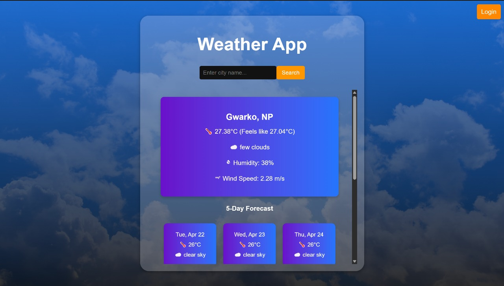

# Weather App 🌤️
## 🟢 Project is live on https://weather-59bf2.web.app/

A modern, responsive weather application built with React that provides real-time weather information, 5-day forecasts, and 24-hour temperature trends with beautiful visualizations.

## ✨ Features

- **Real-time Weather Data**: Get current weather information based on your location
- **City Search**: Search for weather in any city worldwide
- **5-Day Forecast**: View weather predictions for the next 5 days
- **24-Hour Temperature Graph**: Interactive temperature trend visualization using Chart.js
- **User Authentication**: Optional login system with username persistence
- **Geolocation Support**: Automatic weather detection based on user's current location
- **Responsive Design**: Works seamlessly on desktop and mobile devices
- **Weather Details**: Temperature, humidity, wind speed, and weather conditions

## 🛠️ Tech Stack

- **Frontend Framework**: React 19.0.0
- **Build Tool**: Vite 6.1.0
- **Routing**: React Router DOM 7.1.5
- **Charts**: Chart.js 4.4.7 with react-chartjs-2 5.3.0
- **Icons**: React Icons 5.4.0
- **Date/Time**: Moment.js 2.30.1
- **Linting**: ESLint 9.19.0
- **Deployment**: Firebase Hosting
- **API**: OpenWeatherMap API

## 📋 Prerequisites

Before running this project, make sure you have the following installed:

- **Node.js** (version 16.x or higher recommended)
- **npm** (comes with Node.js) or **yarn**
- A modern web browser (Chrome, Firefox, Safari, or Edge)
- An **OpenWeatherMap API key** (free tier available)

## 🚀 Getting Started

### 1. Clone the Repository

```bash
git clone https://github.com/GaneshNeupane01/Weather.git
cd Weather
```

### 2. Install Dependencies

```bash
npm install
```

### 3. Configure API Key

The app uses the OpenWeatherMap API. **Important Security Note**: The repository currently contains a hardcoded API key in the source code. This is a security risk and should be addressed immediately.

**To set up your own API key:**

1. Get a free API key from [OpenWeatherMap](https://openweathermap.org/api)
2. Replace the hardcoded API key in `src/components/Weather.jsx`:
   ```javascript
   const API_KEY = "your_api_key_here";  // Replace with your actual API key
   ```

**Best Practice for Production:**
- Store the API key in environment variables using a `.env` file:
  ```
  VITE_WEATHER_API_KEY=your_api_key_here
  ```
- Update `src/components/Weather.jsx` to use: `import.meta.env.VITE_WEATHER_API_KEY`
- Add `.env` to `.gitignore` to prevent committing secrets
- Never commit API keys to version control

### 4. Run the Development Server

```bash
npm run dev
```

The app will start at `http://localhost:5173` (or another port if 5173 is busy). Open this URL in your browser.

## 🎮 Usage

1. **First Visit**: The app will ask for your name (optional - you can skip this)
2. **Location Permission**: Allow location access to get weather for your current location
3. **Search**: Use the search bar to find weather in any city
4. **View Forecast**: Scroll down to see the 5-day forecast and 24-hour temperature graph
5. **Login/Logout**: Use the navigation button to login or logout

## 🏗️ Building for Production

To create an optimized production build:

```bash
npm run build
```

This will generate a `dist` folder with optimized static files.

To preview the production build locally:

```bash
npm run preview
```

## 🚢 Deployment

### Firebase Hosting

This project is configured for Firebase Hosting. **Note**: The current `firebase.json` is set to deploy from the `build` folder, but Vite builds to `dist` by default.

**Deployment Steps:**

1. Install Firebase CLI:
   ```bash
   npm install -g firebase-tools
   ```

2. Login to Firebase:
   ```bash
   firebase login
   ```

3. Build the project:
   ```bash
   npm run build
   ```
   This creates optimized files in the `dist` folder.

4. **Align build output with Firebase configuration** - Choose one approach:
   
   **Option A (Recommended)**: Update `firebase.json` to point to `dist`:
   ```json
   {
     "hosting": {
       "public": "dist",
       ...
     }
   }
   ```
   
   **Option B**: Copy the build output to the `build` folder:
   ```bash
   mkdir -p build && cp -r dist/* build/
   ```

5. Deploy to Firebase:
   ```bash
   firebase deploy
   ```

## 📁 Project Structure

```
Weather/
├── public/              # Public assets
├── src/
│   ├── assets/          # Images and CSS files
│   │   ├── css/
│   │   │   └── styles.css
│   │   └── images/
│   ├── components/      # React components
│   │   ├── Weather.jsx  # Main weather component
│   │   ├── Weather.css  # Weather component styles
│   │   └── LR.css       # Login/Register styles
│   ├── App.jsx          # Main App component with routing
│   ├── App.css          # App styles
│   ├── Login.jsx        # Login component
│   ├── main.jsx         # Entry point
│   └── index.css        # Global styles
├── .firebaserc          # Firebase project configuration
├── firebase.json        # Firebase hosting configuration
├── vite.config.js       # Vite configuration
├── package.json         # Project dependencies
└── README.md           # This file
```

## 🔧 Available Scripts

- `npm run dev` - Start development server with hot module replacement
- `npm run build` - Build for production
- `npm run preview` - Preview production build locally
- `npm run lint` - Run ESLint to check code quality

## 🌐 API Information

This app uses the [OpenWeatherMap API](https://openweathermap.org/api) to fetch:
- Current weather data
- 5-day weather forecast
- Hourly forecast data

**API Endpoints Used**:
- Current Weather: `https://api.openweathermap.org/data/2.5/weather`
- Forecast: `https://api.openweathermap.org/data/2.5/forecast`

## 🎨 Features in Detail

### Login System
- Optional username input
- Persistent storage using localStorage
- Skip option to use the app without logging in
- Logout functionality

### Weather Display
- Current temperature and "feels like" temperature
- Weather description with emoji icons
- Humidity percentage
- Wind speed in m/s
- City name and country code

### Forecasting
- **5-Day Forecast**: Shows average temperature and weather conditions
- **24-Hour Graph**: Interactive line chart showing temperature trends
- Responsive cards for easy viewing

## 🐛 Troubleshooting

### Location Access Denied
If you deny location access, you'll see a message asking you to search for a city manually.

### API Errors
If you encounter API errors:
- Check your internet connection
- Verify the API key is valid
- Check if you've exceeded the free tier rate limits

### Build Issues
If you face build issues:
```bash
# Clear node_modules and reinstall
rm -rf node_modules package-lock.json
npm install
```


## 👤 Author

**Ganesh Neupane**
- GitHub: [@GaneshNeupane01](https://github.com/GaneshNeupane01)
- Detail: [@portfolio](https://ganesh-neupane.com.np)

## 🤝 Contributing

Contributions, issues, and feature requests are welcome! Feel free to check the [issues page](https://github.com/GaneshNeupane01/Weather/issues).

## ⭐ Show your support

Give a ⭐️ if you like this project!
